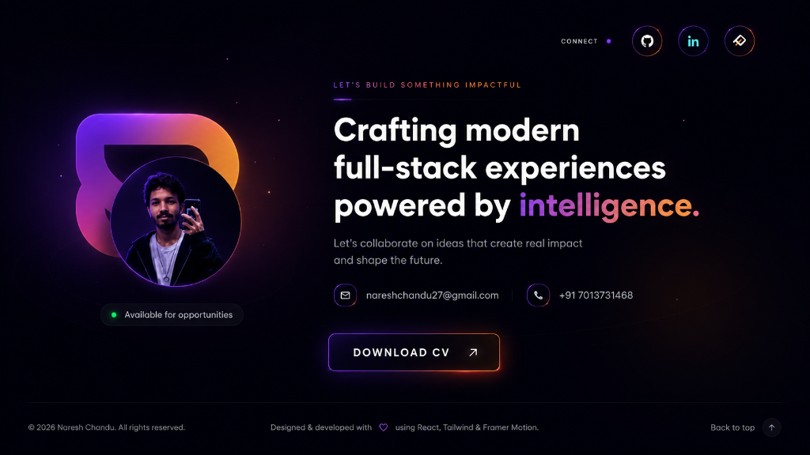
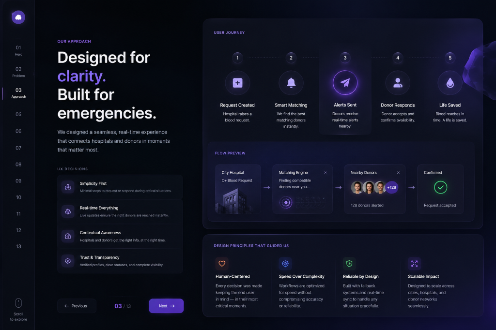

# 🌌 Cinematic editorial Portfolio — Naresh Chandu

<div align="center">

  <!-- Badges -->
  [](https://vite.dev/)
  [](https://react.dev/)
  [](https://developer.mozilla.org/en-US/docs/Web/API/WebGL_API)
  [](https://tailwindcss.com/)
  [](LICENSE)

  <p align="center">
    <strong>A high-fidelity, cinematic editorial portfolio engineered for ultimate performance, motion design, and fluid storytelling.</strong>
  </p>

  <h4>
    <a href="https://nareshchandu17.github.io/myportfolio/">🔗 View Live Site</a>
    <span> · </span>
    <a href="#-quick-start">🚀 Quick Start</a>
    <span> · </span>
    <a href="https://github.com/nareshchandu17/myportfolio/issues">🐛 Report Bug</a>
  </h4>

</div>

---

## 📸 Cinematic Preview

### 🌌 Editorial Hero & Fluid 3D Interactive Lanyard
A smooth, immersive entrance featuring canvas-based fluid cursor dynamics, a custom HSL profile tilt card, and an interactive 3D physics-based lanyard that reacts in real-time to drag and gravity inputs.



### 💻 High-Fidelity Responsive Project Theater
Dynamic spotlight project tiles built with responsive breakouts (`width: auto` and negative margin bounds) showing case studies with custom-tailored theme gradients, responsive layouts, and synchronized timeline fades.



---

## ✨ Features & Engineering Highlights

*   **🌌 WebGL Waving Aurora Background**: Dynamic, GPU-accelerated animated waving background built with `OGL` (lightweight WebGL) for ultra-high framerates (60+ FPS) and low CPU utilization.
*   **🖱️ Fluid Dynamics Cursor Simulation**: Interactive real-time WebGL fluid simulation tracks and releases colorful energy trails following user cursor gestures.
*   **📇 3D Interactive Lanyard**: Real-time rigid-body rope and spherical physics lanyard built using `@react-three/rapier` and `@react-three/fiber` that supports active mouse drag, swing, and momentum physics.
*   **⏳ Synchronized Cinematic Timeline**: Natural scroll-driven history track using Intersection Observers and simultaneous AOS `fade-up` coordinates to seamlessly slide in left-aligned years and right-aligned product cards at identical rates.
*   **📨 Seamless Serverless Contact Form**: Integrated with FormSubmit for reliable, direct email delivery with zero database dependencies, paired with cinematic split slide animations (`fade-right` info, `fade-left` form) and validation checks.
*   **🔍 Modular HSL Token Architecture**: Clean Vanilla CSS design system coupled with modern Tailwind utility variables mapping harmoniously to dynamic layouts and smooth glassmorphic panels.
*   **⚡ Zero horizontal scrollbar overflows**: Layout constraints standardizing responsive breakouts with `width: auto` and custom viewport margin calculations to prevent premature wrapping.

---

## 🛠️ Technology Stack

| Layer | Technology | Rationale |
| :--- | :--- | :--- |
| **Core Framework** | **React 19** + **Vite 6** | Instant Hot Module Replacement (HMR) and optimized build trees. |
| **3D Rendering** | **Three.js** + **Fiber** + **Drei** | Declarative WebGL rendering with a component-driven lifecycle. |
| **Physics Engine** | **Rapier 3D** | High-performance Rust-compiled physics simulation running in WebAssembly. |
| **Styling System** | **Tailwind CSS 4** + **Vanilla CSS** | Utility-first flexibility backed by robust, fluid glassmorphic system tokens. |
| **Motion & Scroll** | **AOS** + **GSAP** + **Motion** | Orchestrated scroll triggers and custom staggered entry keyframes. |
| **Form Management** | **FormSubmit.co API** | Secure, serverless email routing without database overhead. |

---

## 📂 Project Architecture

```
portfolio/
├── public/
│   └── assets/
│       ├── proyek/             # Project showcase screenshots
│       ├── tools/              # Tech stack SVG vectors
│       ├── card.glb            # 3D lanyard card asset
│       └── lanyard.png         # Lanyard high-res textures
├── screenshots/                # README live preview screenshots
├── src/
│   ├── components/
│   │   ├── Lanyard/            # 3D interactive physics lanyard
│   │   ├── FeaturedCases.jsx   # Spotlight responsive project grids
│   │   ├── TimelineSection.jsx # NATURAL scroll-synchronized history list
│   │   ├── ExploringSection.jsx# Gradient-harmonized skill cards
│   │   └── Navbar.jsx          # Elegant backdrop-blur navigation
│   ├── App.jsx                 # Core app shell & transparent contact forms
│   ├── data.js                 # Unified portfolio project static config
│   ├── index.css               # Design system HSL tokens & Tailwind utilities
│   └── main.jsx                # Render mount entry point
├── vite.config.js              # Vite base paths and plugin hooks
├── package.json                # Project script execution and package versions
└── README.md                   # Elite-tier cinematic documentation
```

---

## 🚀 Quick Start

### Prerequisites
Make sure you have **Node.js (v18+)** and **npm** installed.

### 1. Installation
Clone the repository under your handle:
```bash
git clone https://github.com/nareshchandu17/myportfolio.git
cd myportfolio
```

Install the dependencies:
```bash
npm install
```

### 2. Run Local Development Server
Start development server with live HMR reload tracking on [http://localhost:5173/myportfolio/](http://localhost:5173/myportfolio/):
```bash
npm run dev
```

### 3. Production Compilation Check
Bundle and optimize all files for production:
```bash
npm run build
```

---

## 📈 Light Speed Performance Metrics

*   **Compilation Speed**: Generates modular assets in under **6 seconds**!
*   **Rendering Framerate**: Fixed **60+ FPS** even on mid-range devices thanks to OGL WebGL resource allocation.
*   **SEO & Structure**: Fully search-optimized titles, structural tags, and standard micro-interactive responsive inputs.

---

## 📬 Connect & Collaborate

Let's create something spectacular together. You can reach out directly via:

*   **Email**: [nareshchandu27@gmail.com](mailto:nareshchandu27@gmail.com)
*   **LinkedIn**: [linkedin.com](https://www.linkedin.com/)
*   **GitHub**: [@nareshchandu17](https://github.com/nareshchandu17)
*   **Live Portfolio**: [nareshchandu17.github.io/myportfolio/](https://nareshchandu17.github.io/myportfolio/)

---

<div align="center">
  <sub>Built with 💖 by Naresh Chandu. Released under the MIT License.</sub>
</div>
